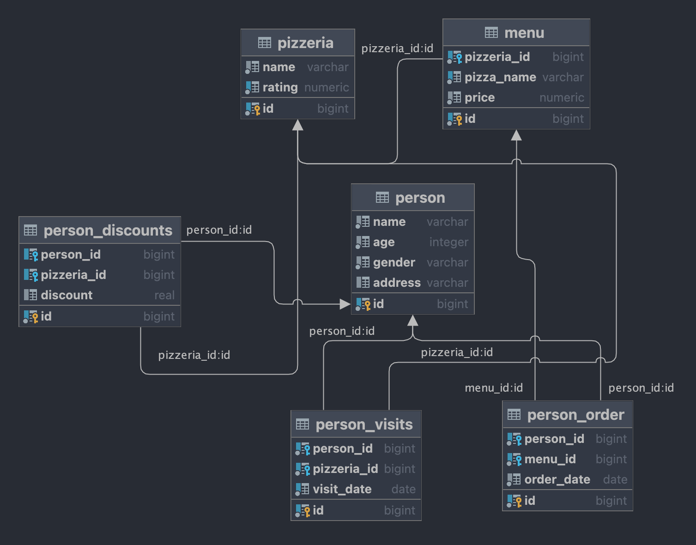
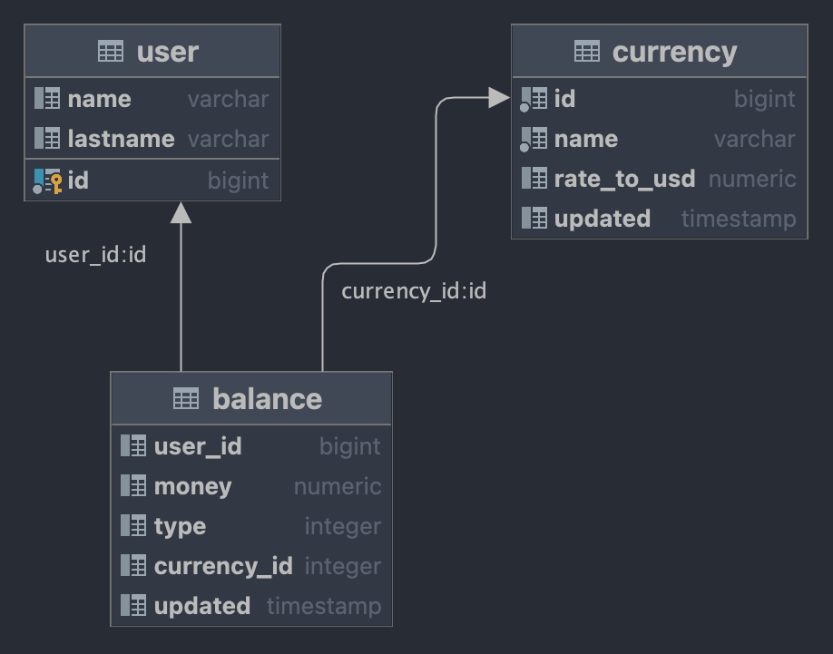

# SQL Bootcamp

## Content

### [Description](https://github.com/D-Dashka/SQL-Bootcamp#https://github.com/D-Dashka/SQL-Bootcamp#description-1)

### [Schemas preview](https://github.com/D-Dashka/SQL-Bootcamp#schemas)

### [Exercises](https://github.com/D-Dashka/SQL-Bootcamp#exercises-1)

## Description
SQL Bootcamp at School21 is an introduction to SQL language and databases in the intensive format: you need to complete and defend exercises every day to successfully complete the Bootcamp.
Each module (day) in Bootcamp contains tasks dedicated to implementation of SQL statements to retrieve needed data from given database.

Database Management System used in Bootcamp is <code>PostgreSQL</code>.

IDE I used: ***DataGRIP*** from JetBrains.

## Schemas

### Main database schema

	

### Database schema for Team01 Project

	

## Exercises

***DAY00-DAY03***

Basic SQL syntax: use of SELECT, JOIN, UNION etc.

***DAY04***

Task is dedicated to virtual views and physical snapshots of data.

***DAY05 - DAY07***

 Data Governance Policies, Database indexes, Database Sequences.

***DAY08***

Transactions and isolation levels.

***SQL_DAY09***

The task of the day is to create PostgreSQL functions to process the data.

***SQL_TEAM01***

DWH, ETL process, data with anomalies.

The task is to write a SQL statement that returns the total volume (sum of all money) of transactions from user balance aggregated by user and balance type.
